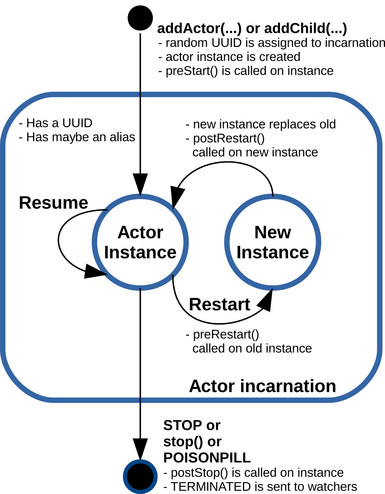

## Actor4j an actor implementation ##
Aim of this project was to enhance the performance in message passing. As a reference implementation `Akka` [1] was used. Results of the research shown that intra-thread-communication is much better than inter-thread-communication. You can group actors, so they are bound to the same thread, for instance. Message queues of the actors are outsourced to the thread. The **four principles of reactive manifesto** [2] and the **four semantic properties** [3] of actor systems have been applied. The actor system is from extern accessible by the REST-API or by a websocket. Between the nodes are websockets for message transfer established. Time consuming tasks can be outsourced to `ResourceActor's`, which are executed by an extra `ThreadPool`. So the responsiveness of the actor system therfore will not tangented.

>[1] Lightbend (2016). Akka. http://akka.io/  
>[2] Jonas Bonér, Dave Farley, Roland Kuhn, and Martin Thompson (2014). The Reactive Manifesto. http://www.reactivemanifesto.org/  
>[3] Rajesh K. Karmani, Gul Agha (2011). Actors. In Encyclopedia of Parallel Computing, Pages 1–11. Springer. http://osl.cs.illinois.edu/media/papers/karmani-2011-actors.pdf  

## Configuration, starting and stopping the actor system ##
In `actor4j` the following important configuration options are available.
```java
ActorSystem system = new ActorSystem();

system
	.setParallelismMin(1)
	.setParallelismFactor(1);
	.softMode(); // or .hardMode();
```
On the one hand, the number of threads can be set with `setParallelismMin` and the scaling factor with `setParallelismFactor`:

>Number of threads = parallelismMin * parallelismFactor

In addition, it can be determined whether the threads are operating in soft or hard mode if the situation occurs that temporarily no messages are received. The actor system is started with the call:
```java
system.start();
```
The actor system can be terminated, either with controlled shutdown of all actors or not. With a controlled shutdown, a stop directive is sent internally to all actors. By means of parameter transfer, it is possible to determine whether the calling thread waits until the shutdown of the actor system has been completely terminated.
```java
system.shutdown(); // normal shutdown
system.shutdown(true); // shutdown and wait

system.shutdownWithActors(); // shutdown with actors
system.shutdownWithActors(true);
```

`Actor4j` solves a controlled shutdown by sending a termination message to the user actor (father node of all actors, tree structure), which results that the other subordinate actors are terminating in a cascade form. The actors themselves are responsible for an orderly handling of their termination.

## Actors, pattern matching and behaviour ##
There are two possibilities to add actors to the actor system. On one hand, by specifying the class and its constructor (is then instantiated using reflection) or via a factory method. Both variants are passed to a dependency injection container, which can then instantiate the actors accordingly. Actors can be generated outside the actor system, these are automatically subordinated to the user actor (father of all user-generated actors). However, they can also be generated within an actor, but these are then child actors of the corresponding actor. After instantiation, they return a unique `UUID` (unambiguous identification of the actor).
```java
// over reflection
system.addActor(MyActor.class, "MyActor", ...);
// or using a factory method
system.addActor(new ActorFactory() {
	@Override
	public Actor create() {
		 return new MyActor();	
	 }
});

// or in the context of an actor
addChild(MyActor.class, "MyActor", ...);				
// or
UUID myActor = addChild( () -> new MyActor() ); 
```
Actors must derive from the class `Actor` and implement the `receive` method. In the example below, `MyActor` waits for a message that contains a `String` and then outputs it via a logger. Subsequently, the message is sent back to the sender. When a different message is received, a warning (`unhandled (message)`) is outputted if `debugUnhandled` has been set in the actor system.
```java
import actor4j.core.actors.Actor;
import actor4j.core.messages.ActorMessage;
import static actor4j.core.utils.ActorLogger.*;

public class MyActor extends Actor {
	@Override
	public void receive(ActorMessage<?> message) {
		if (message.value instanceof String) {
			logger().info(String.format(
				"Received String message: %s", message.valueAsString()));
			send(message, message.dest);
		} 
		else
			unhandled(message);
	}
}		            
```
Messages can be sent using the `send` method. The following methods are available. `Tell` offers a similar syntax to `Akka`. A message can also be forwarded (`forward`). Aliases are among other things available to access a remote actor in a simplified manner.
```java
send(ActorMessage<?> message)
send(ActorMessage<?> message, String alias)
send(ActorMessage<?> message, UUID dest)
tell(T value, int tag, UUID dest)

forward(ActorMessage<?> message, UUID dest)
```
### Patern matching ###
To receive messages, pattern matching can be used with the `ActorMessageMatcher` class. This class was inspired by pattern matching in `Scala`. The message can be checked to match a tag, source, or class of the passed object (value). If a match is true, an action is triggered. This example is based on the top, except that this is expressed by the language means of the class `ActorMessageMatcher`. Tags serve as a simple means of communication. `ACK` would be such a tag.
```java
public class MyActor extends Actor {
	protected ActorMessageMatcher matcher;
	protected final int ACK = 1;
	
	@Override
	public void preStart() {
		matcher = new ActorMessageMatcher();
		
		matcher
		.match(String.class, 
			msg -> logger().info(String.format(
				"Received String message: %s", msg.valueAsString())))
		.match(ACK, 
			msg -> logger().info("ACK tag received"))
		.matchAny(
			msg -> send(msg, msg.dest))
		.matchElse(
			msg -> unhandled(msg));
	}
	
	@Override
	public void receive(ActorMessage<?> message) {
		matcher.apply(message);
	}
}                
```
`MatchAny` is always triggered, no matter what message has been received. If no match is found, `MatchElse` is fired.

### Behaviour ###
The message processing method `receive` of an actor can be replaced by another method at runtime (`HotSwap` to `Akka`). In the later example, the behavior of the actor is changed (on receipt of a tag `SWAP`). Upon receipt of the next message, information about the then received message is outputted. Finally, the behavior with `unbecome` is returned to the original `receive` method.
```java
public class MyActor extends Actor {
	protected final int SWAP=22;
	
	@Override
	public void receive(ActorMessage<?> message) {
		if (message.tag == SWAP)
			become(msg -> {
				logger().info(String.format(
					"Received message: %s", msg));
				unbecome();
			}, false); // false -> putted on stack
		else
			unhandled(message);
	}
}
```
## Life cycle of actors, monitoring ##



Fig. 1: Representation of the life cycle of an actor (adapted for `actor4j` according to Lightbend [4])
>[4] Lightbend (2016). Actors. UntypedActor API. http://doc.akka.io/docs/akka/2.4/java/untyped-actors.html

### Life cycle ###
As already mentioned, actors are either instantiated via `system.addActor(...)` or `parentActor.addChild(...)`. Actors then receive a randomly generated `UUID` as a unique identifier, with which they then can communicate with other actors (sending messages). An actor can also have an alternative identifier, the alias (also for the purpose of better legibility or when the `UUID` is not previously known). By the first awaken of the actor the `preStart` method is initially called. This method will be used for first initializations of the actor. An actor can also be restarted, usually triggered by an exception (see chapter Supervision). In this case, by the old instance `preRestart` is called first. Then a new instance is generated with the dependency injection container. The old instance is replaced by the new instance, and the method `postRestart` is called by the new instance. The `preRestart` and `postRestart` methods are used so that the actor can react adequately to the situation of the restart. The marking (`UUID`) of the original actor is retained. This also guarantees that references from other actors to this actor will stay valid. An actor can be stopped either by calling the `stop` method or by receiving the `STOP` or `POISONPILL` message.
### Monitoring ###
An actor can also monitor another actor for that it has not yet terminated itself. If the observed actor is terminated, a message `TERMINATED` is sent to the observer. An assignment is then made via `message.source`, which corresponds to the sender's `UUID`. With `watch`, an observer can register with an actor and de-register with `unwatch`.
```java
watch(UUID dest)
unwatch(UUID dest)
```
### Comparison to Akka ###
The life cycle and monitoring are largely similar to Akka's approach. Instead of a UUID, an ActorRef is returned when an actuator is instantiated.

Page to be updated 11/18/2016