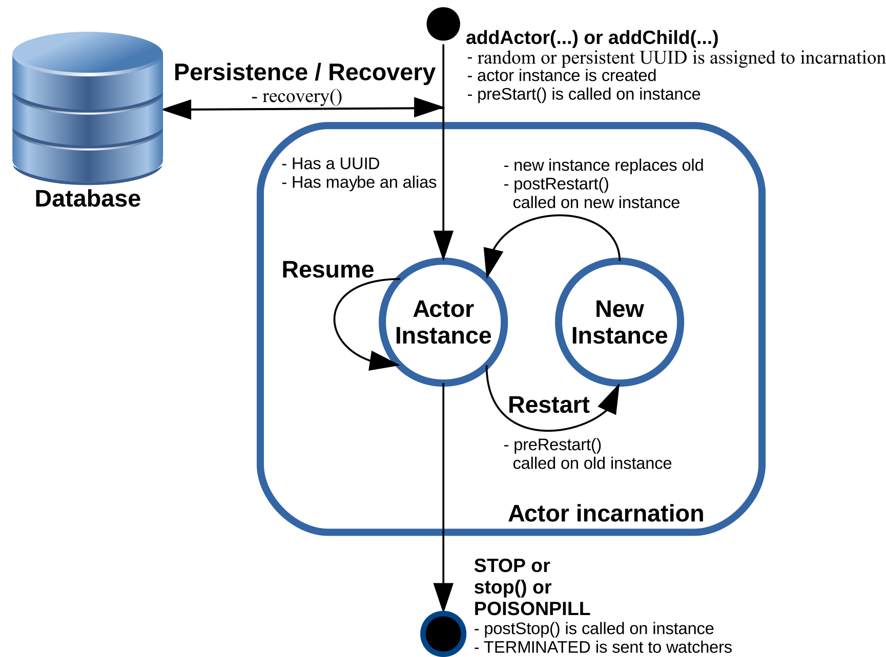
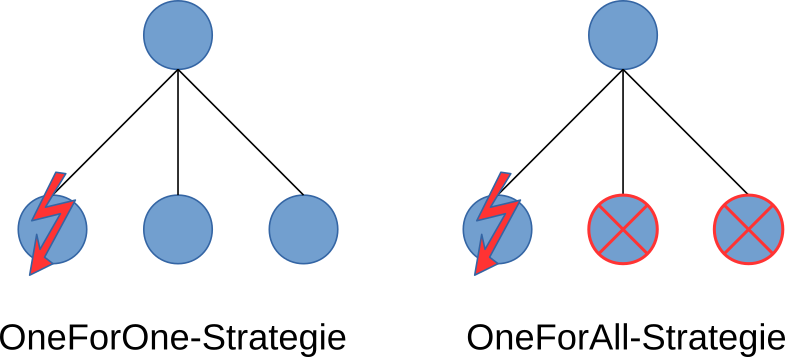
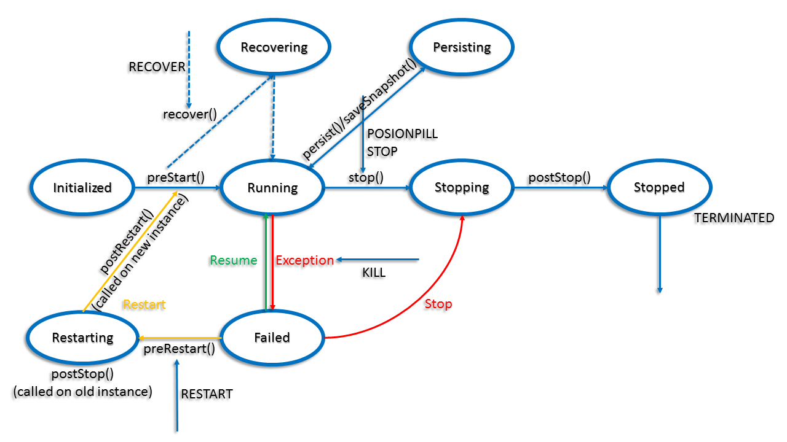
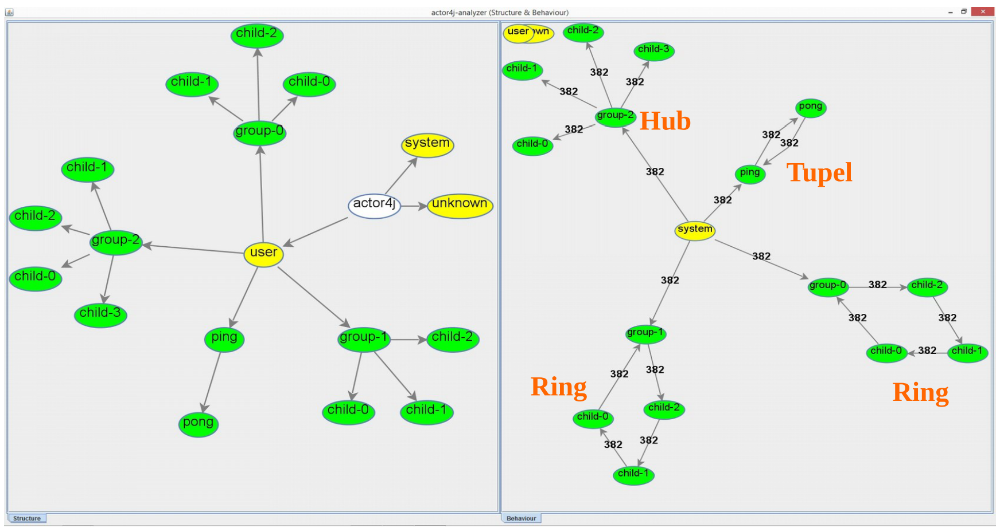

[](https://travis-ci.org/relvaner/actor4j-core)
[](https://www.versioneye.com/user/projects/5ada707b0fb24f5450e021a4)
[](https://coveralls.io/github/relvaner/actor4j-core?branch=master)
<!-- [](https://gitter.im/actor4j/actor4j) -->
<!-- [](https://gitter.im/actor4j/actor4j) -->

## Actor4j an actor implementation ##
Aim of this project was to enhance the performance in message passing. As a reference implementation `Akka` [[1](#1)] was used. Results of the research shown that intra-thread-communication is much better than inter-thread-communication. You can group actors, so they are bound to the same thread, for instance. Message queues of the actors are outsourced to the thread. The **four principles of reactive manifesto** [[2](#2)] and the **four semantic properties** [[3](#3)] of actor systems have been applied. The actor system is from extern accessible by the REST-API or by a websocket. Between the server nodes (cluster configuration) are websockets for message transfer established. Time consuming tasks can be outsourced to `ResourceActor's`, which are executed by an extra `ThreadPool`. So the responsiveness of the actor system therfore will not tangented.

## Configuration, starting and stopping the actor system ##
In `actor4j` the following important configuration options are available.
```java
ActorSystem system = new ActorSystem();

system
	.setParallelismMin(1)
	.setParallelismFactor(1);
	.softMode(); // or .hardMode();
```
On the one hand, the number of threads can be set with `setParallelismMin` and the scaling factor with `setParallelismFactor`:

>Number of threads = parallelismMin * parallelismFactor

In addition, it can be determined whether the threads are operating in soft or hard mode if the situation occurs that temporarily no messages are received. The actor system is started with the call:
```java
system.start();
```
The actor system can be terminated, either with controlled shutdown of all actors or not. With a controlled shutdown, a stop directive is sent internally to all actors. By means of parameter transfer, it is possible to determine whether the calling thread waits until the shutdown of the actor system has been completely terminated.
```java
system.shutdown(); // normal shutdown
system.shutdown(true); // shutdown and wait

system.shutdownWithActors(); // shutdown with actors
system.shutdownWithActors(true);
```

`Actor4j` solves a controlled shutdown by sending a termination message to the user actor (father node of all actors, tree structure), which results that the other subordinate actors are terminating in a cascade form. The actors themselves are responsible for an orderly handling of their termination.

## Actors, pattern matching and behaviour ##
There are two possibilities to add actors to the actor system. On one hand, by specifying the class and its constructor (is then instantiated by using reflection) or via a factory method. Both variants are passed to a dependency injection container, which can then instantiate the actors accordingly. Actors can be generated outside the actor system, these are automatically subordinated to the user actor (father of all user-generated actors). However, they can also be generated within an actor, but these are then child actors of the corresponding actor. After instantiation, the function returns a unique `UUID` (unambiguous identification of the actor).
```java
// over reflection
system.addActor(MyActor.class, "MyActor", ...);
// or using a factory method
system.addActor(new ActorFactory() {
	@Override
	public Actor create() {
		 return new MyActor();	
	 }
});

// or in the context of an actor
addChild(MyActor.class, "MyActor", ...);				
// or
UUID myActor = addChild( () -> new MyActor() ); 
```
Actors must derive from the class `Actor` and implement the `receive` method. In the example below, `MyActor` waits for a message that contains a `String` and then outputs it via a logger. Subsequently, the message is sent back to the sender. When a different message is received, a warning (`unhandled (message)`) is outputted if `debugUnhandled` has been set in the actor system. [[4](#4)]
```java
public class MyActor extends Actor {
	@Override
	public void receive(ActorMessage<?> message) {
		if (message.value instanceof String) {
			logger().info(String.format(
				"Received String message: %s", message.valueAsString()));
			send(message, message.source);
		} 
		else
			unhandled(message);
	}
}		            
/* Adapted for actor4j according to [4] */
```

Messages can be sent using the `send` method. The following methods are available. `Tell` offers a similar syntax to `Akka`. A message can also be forwarded (`forward`). Aliases are among other things available to access a remote actor in a simplified manner.
```java
send(ActorMessage<?> message)
send(ActorMessage<?> message, UUID dest)
sendViaPath(ActorMessage<?> message, String path)
sendViaAlias(ActorMessage<?> message, String alias)
tell(T value, int tag, UUID dest)

forward(ActorMessage<?> message, UUID dest)
```

The structure of the `ActorMessage<T>` looks like that:

| Type | Name | Description |
| :---: | :---: | :---: |
| T | value | payload of the message |
| int | tag | tags helps for differentiating between messages  |
| UUID | source | source of the message |
| UUID | dest | destination of the message |
<!--| boolean | ref | call-by-reference or call-by-value (needs deep copy)|-->

Tab. 1: Structure of the `ActorMessage<T>`

### Patern matching ###
To receive messages, pattern matching can be used with the `ActorMessageMatcher` class. This class was inspired by pattern matching in `Scala` [[12](#12)]. The message can be checked to match a tag, source, or class of the passed object (value). If a match is true, an action is triggered. This example is based on the top, except that this is expressed by the language means of the class `ActorMessageMatcher`. Tags serve as a simple means of communication. `ACK` would be such a tag.
```java
public class MyActor extends Actor {
	protected ActorMessageMatcher matcher;
	protected final int ACK = 1;
	
	@Override
	public void preStart() {
		matcher = new ActorMessageMatcher();
		
		matcher
		.match(String.class, 
			msg -> logger().info(String.format(
				"Received String message: %s", msg.valueAsString())))
		.match(ACK, 
			msg -> logger().info("ACK tag received"))
		.matchAny(
			msg -> send(msg, msg.dest))
		.matchElse(
			msg -> unhandled(msg));
	}
	
	@Override
	public void receive(ActorMessage<?> message) {
		matcher.apply(message);
	}
}                
```
`MatchAny` is always triggered, no matter what message has been received. If no match is found, `MatchElse` is fired.

### Behaviour ###
The message processing method `receive` of an actor can be replaced by another method at runtime (`HotSwap`  to `Akka` [[6](#6)]). In the later example, the behavior of the actor is changed (on receipt of a tag `SWAP`). Upon receipt of the next message, information about the then received message is outputted. Finally, the behavior with `unbecome` is returned to the original `receive` method.
```java
public class MyActor extends Actor {
	protected final int SWAP=22;
	
	@Override
	public void receive(ActorMessage<?> message) {
		if (message.tag == SWAP)
			become(msg -> {
				logger().info(String.format(
					"Received message: %s", msg));
				unbecome();
			}, false); // false -> putted on stack
		else
			unhandled(message);
	}
}
```
## Simple Example ##
```java
// Initialize the actor system
ActorSystem system = new ActorSystem("Example");
		
// Creation of actor pong
UUID pong = system.addActor(() -> new Actor() {
	@Override
	public void receive(ActorMessage<?> message) {
		// Receives message from ping
		System.out.println(message.valueAsString());
		// Sends message "pong" to ping
		tell("pong", 0, message.source);
	}
});
// Creation of actor ping
UUID ping = system.addActor(() -> new Actor() {
	@Override
	public void receive(ActorMessage<?> message) {
		if (message.value!=null)
			// Receives message from pong
			System.out.println(message.valueAsString());
		// Sends message "ping" to pong
		tell("ping", 0, pong);
	}
});
		
// Starts the actor system
system.start();
		
// Sends a message to ping to start the ping-pong process
system.send(new ActorMessage<>(null, 0, system.SYSTEM_ID, ping));
		
// Lifetime for the ping-pong process
try {
	Thread.sleep(2000);
} catch (InterruptedException e) {
	e.printStackTrace();
}
// Wait until all actors are shutdown
system.shutdownWithActors(true);
```

## Life cycle of actors, monitoring ##


Fig. 1: Representation of the life cycle of an actor (adapted for `actor4j` according to [[4](#4)])

### Life cycle ###
As already mentioned, actors are either instantiated via `system.addActor(...)` or `parentActor.addChild(...)`. Actors then receive a randomly generated (or persistent) `UUID` as a unique identifier, with which they then can communicate with other actors (sending messages). An actor can also have an alternative identifier, the alias (also for the purpose of better legibility or when the `UUID` is not previously known). By the first awaken of the actor the `preStart` method is initially called. This method will be used for first initializations of the actor. It will be also called the method `recover`, if the actor is a `PersistentActor`. This method recoveres then the state of the actor. An actor can also be restarted, usually triggered by an exception (see chapter Supervision). In this case, by the old instance `preRestart` is called first. Then a new instance is generated with the dependency injection container. The old instance is replaced by the new instance, and the method `postRestart` is called by the new instance. The `preRestart` and `postRestart` methods are used so that the actor can react adequately to the situation of the restart. The marking (`UUID`) of the original actor is retained. This also guarantees that references from other actors to this actor will stay valid. An actor can be stopped either by calling the `stop` method or by receiving the `STOP` or `POISONPILL` message. [[4](#4)][[15](#15)]
### Monitoring ###
An actor can also monitor another actor for that it has not yet terminated itself. If the observed actor is terminated, a message `TERMINATED` is sent to the observer. An assignment is then made via `message.source`, which corresponds to the sender's `UUID`. With `watch`, an observer can register with an actor and de-register with `unwatch`. [[4](#4)]
```java
watch(UUID dest)
unwatch(UUID dest)
```
### Comparison to Akka ###
The life cycle and monitoring are largely similar to Akka's approach. Instead of a `UUID`, an `ActorRef` is returned when an actor is instantiated.
## Supervision ##



Fig. 2: `OneForOne-Strategy` and `OneForAll-Strategy` (cp. [[7](#7)][[8](#8)])

The supervisor actor monitors its child actors, in the event of an error, they are resumed or restarted or stopped by them. Two strategies are foreseen (see Fig. 2). In the `OneForOne-Strategy`, only the affected actor is considered. In the `OneForAll-Strategy`, on the other hand, not only the affected actor is considered but also the neighbouring actors (below the supervisor actor). [[7](#7)][[8](#8)] The default strategy for `actor4j` is a `OneForOne-Strategy` [[11](#11)] and is specified as:
```java
public SupervisorStrategyDirective apply(Exception e) {
	if (
	     e instanceof ActorInitializationException || 
	     e instanceof ActorKilledException)
		return STOP;
	else
		return RESTART;
}
```
An `ActorInitializationException` is thrown if an error occurs during the instantiation of an actor. An `ActorKilledException` is triggered by an incoming `KILL` message at the actor. In this case, an exception is deliberately provoked to activate the supervisor and its error handling strategy. A restart is carried out by default for every exception otherwise the actor is stopped. The default strategy can be changed by overriding the `supervisorStrategy` method. [[4](#4)]



Fig. 3: Extended representation of the life cycle of an actor (cp. [[5](#5)])

`Actor4j` currently supports seven directives: `RESUME`, `STOP`, `RESTART`, `ESCALATE`, `RECOVER`, `ACTIVATE` and `DEACTIVATE` (see also Fig. 3). Stopping and restarting of the actors is asynchronous.

* `RESUME`: In this case, the supervisor remains passive. The actor can continue its activities undisturbed [[5](#5)].
* `STOP`:
  * To all children the message `STOP` is sent (recursive process, if the children also have children) so that they can terminate. Use of `watch`, to observe that all children have terminated.
  * Call of `postStop`.
* `RESTART`:
  * `PreRestart` is called at the current instance.
  * To all children the message `STOP` is sent (recursive process, if the children also have children) so that they can terminate. Use of `watch`, to observe that all children have terminated.
  * Call of `postStop` at the current instance, after all children have finished and confirmed this with the `TERMINATED` message.
  * Instantiate a new instance with the dependency injection container. It is ensured that the `UUID` is maintained.
  * Call of `postRestart` (with `preStart` (with optional `recover`) for the new instance.
* `ESCALATE`: If a supervisor is unclear as to what the correct strategy is in the event of a specific error, he can pass it on to his superior supervisor for clarification.
* `RECOVER`: The actor will be recovered to it's last state, novel events can lead to an update of the actor's state.
* `ACTIVATE` and `DEACTIAVTE`: Activates or deactivates the actor (messages will be or not longer processed). The current explained directives remains deliverable, even when the actor is deactivated.

[[4](#4)][[5](#5)][[11](#11)][[15](#15)]

## Persistence ##
To persist the state of an actor, this must be derived from the `PersistentActor` class. A `PersistentActor` is characterized by events and a state, which can be saved, depending on use case. In the example below, two events are defined. First, a snapshot of the state is made and persisted. Then the two events are saved. Handlers are defined for error handling and for a successful case. In general after successful saving the events, the state of the actor can be updated. Side effects can be triggered, which may be affects other actors. The `recover` method is called to recover the state of the actor. It is loaded from the database, where the last state and the last events have been persisted. With the help of the `Recovery` class this attributes can be loaded, for this purpose the `json` `String` will be transformed to a `Recovery` object. The principles of `Event Sourcing` [[16](#16)] are followed, as a database `MongoDB` [[17](#17)] is currently used. Every `PersistentActor` must have a persistent `UUID` for unique access. [[15](#15)]
```java
public class MyActor extends PersistentActor<MyState, MyEvent> {
	@Override
	public void receive(ActorMessage<?> message) {
    	// two events are generated based on the received message (!)
		MyEvent event1 = new MyEvent("I am the first event!");
		MyEvent event2 = new MyEvent("I am the second event!");
		
        // the events will be persisted
		persist(
			(s) -> logger().debug(String.format("Event: %s", s)), 
			(e) -> logger().error(String.format("Error: %s", e.getMessage())),
			event1, event2);		
            
        // the state will be persisted
        saveSnapshot(null, null, new MyState("I am a state!"));
	}
    
    @Override
	public void recover(String json) {
		if (!Recovery.isError(json)) {
			Recovery<MyState, MyEvent> obj = Recovery.convertValue(json, 
           		new TypeReference<Recovery<MyState, MyEvent>>(){});
			logger().debug(String.format("Recovery: %s", obj.toString()));
		}
		else
			logger().error(String.format("Error: %s", Recovery.getErrorMsg(json)));
	}
			
	@Override
	public UUID persistenceId() {
		return UUID.fromString("60f086af-27d3-44e9-8fd7-eb095c98daed");
	}
}		            
```

## Presentation of different actor types within `actor4j` ##
Four important actors, derived from the class `Actor`, are to be presented next. The class `Actor` is an abstract class.

### ActorGroupMember (Interface) ###
The use of this interface signals to the `ActorSystem` that the correspondingly implemented actor is a member of a group. This is taken into account when distributing the actors to the threads. Actors belonging to a group are held together on a thread. The basic idea behind this has already been explained in our paper (see chapters results and conclusion [[?](#?)]). Inter-communication between threads is more expensive than pure intra-communication (within the same thread).

### ActorWithGroup ###
This class implements the interface `ActorGroupMember`.

### ResourceActor ###
Workload tasks should not be performed within the `ActorSystem`. Because they block the reactive system and it is no longer responsive. Therefore the class `ResorceActor` is provided. These special actors are executed in a separate thread pool, thus avoiding disturbances within the `ActorSystem`. It should distinguish stateless (`@Stateless`) and stateful (`@Stateful`) actors. The advantage of this distinction lies in the fact that stateless actors can be executed in parallel.

### ActorWithRxStash ###
The `ActorWithRxStash` class implements the queue `stash`, from the class `Actor`. With `stash`, messages can be temporarily stored, which are not to be processed immediately. `RxStash` provides access to `stash` as an observer by using `RxJava` [[9](#9)]. This allows a comfortable access to `stash` (filters, transformations, aggregators, etc.).

### PseudoActor ###
A `PseudoActor` is a mediator between the outside world and the `ActorSystem`. It allows communication with the actors within the actor system from outside. Unlike the other actors, the `PseudoActor` has its own message queue, in which the messages of other actors can then be stored by the `ActorSystem`. The class `PseudoActor` is derived from the class `ActorWithRxStash`. To be able to process received messages, the run method must be started manually.

#### Note ####
Examples for the actors `ActorWithRxStash` and `PseudoActor` can be viewed under GitHub [[10](#10)]. Application examples for `ActorGroupMember` are also included in the benchmarks of `actor4j`.

## Class diagram to the core components ##
Now, the core components of `actor4j` are presented both from the user perspective as well from the developer perspective. In particular, connections between the core components will be clarified.

### User's point of view ###
The most important core components of `actor4j` can be seen in the overview (Fig. 4). The normal user of `actor4j` will mainly work with the classes `ActorSystem` and the different actor classes (`Actor`, `ActorGroupMember`, `ActorWithRxStash`, `ResourceActor`). Possibly, the user will change the supervisor strategy. A timer (`ActorTimer`) should also be relatively useful in different situations. The `ActorService` class is used for a potential server (see also chapter, cluster configuration).

### Developer's point of view ###
For a potential supporter or interested person, further details are helpful. The class `ActorSystem` is a wrapper of the class `ActorSystemImpl`. `ActorSystemImpl` internally creates a map of the set `ActorCell`. A wrapper is also the class `Actor` from the class `ActorCell`. `ActorSystemImpl` uses the `ActorExecuterService` to generate the `ActorThreads`. `ActorThreads` are executing the actors when they have received a message. The `ActorMessageDispatcher` acts as a link between the actors during message passing. It places the new message in the appropriate queue of the `ActorThread`. In the case of an actor error, the `ActorThread` class is called the auxiliary class `ActorStrategyOnFailure`, which then executes the defined strategy of the supervisor (`OneForOneSupervisorStrategy` or `OneForAllSupervisorStrategy`). Supervisor strategies can affect the `RestartProtocol` as well as the `StopProtocol`. These protocols can also be triggered by a corresponding message to the actor (`RESTART`, `STOP` or `POISONPILL`). `PseudoActor` has its own `ActorCell`, which is called `PseudoActorCell`. This also includes a separate queue for the purpose of communication between the actor system and the outside world (the `PseudoActor`). Last but not least again to the `ActorMessageDispatcher`. The `ActorBalancingOnCreation` class is used to distribute the actors on the `ActorThreads` when the actor system is started. At runtime, the class `ActorBalancingOnRuntime` is used.


Fig. 4: Class diagram to the core components of `actor4j`

#### Note ####

Enclosed two scruffy class diagrams maked with `yuml.me`, have fun!
* [Class diagram - top down](https://raw.githubusercontent.com/relvaner/actor4j-doc/master/doc/images/cd_top_down.png)
* [Class diagram - left to right](https://raw.githubusercontent.com/relvaner/actor4j-doc/master/doc/images/cd_left_right.png)

## Cluster configuration ##

In the cluster, `actor4j` can also be operated. A tomcat server is generally used as the front end. A server node can be addressed via a `REST API` ([see the current specification](http://docs.actor4j.apiary.io)) or over a websocket connection. The servers in the cluster exchange messages via websocket connections. Of course access to a server node is also possible as a client. The websocket approach is similar to the REST API (see Fig. 5).


Fig. 5: Representation of the basic calls to the `actor4j` `REST API`

Each actor has a unique ID (`UUID`). Alternatively, an actor can also be addressed via an alias instead of its ID. For remote access this is quite handy. Before a message can be processed, it is checked whether the corresponding addressee (actor) is running on the local machine. If this is not the case, an attempt is made to determine on which host the addressee can be located (1, 2). Subsequently, the message is sent to the destination host (3). Already found addressees are temporarily stored for later easy access (use of Guava Cache [[14](#14)]).

<!--
#### Note ####
~~An example can be found under ([Actor4j - Cluster Examples](https://github.com/relvaner/actor4j-cluster-examples))~~ and there is also a template (see [Actor4j - Web - Template](https://github.com/relvaner/actor4j-web-template)).
-->

## Structure and behavioral analysis with an analysis tool ##

An analysis tool (using JGraphX [[13](#13)] for visualizations) is suitable for testing, checking and optimizing an actor system. Such a tool is shown in Fig. 6. The internal structure of the actor system and the behavior of the actor system are shown on the left. The ellipses each correspond to one actor. The numbers at the edges between the actors, corresponds to the frequency of the exchange of messages. The right representation contains two rings, a hub and a tuple, linked in the message exchange. The impetus for message distribution is triggered via a timer (marked as `system`, since implemented from outside the actor system). It might be useful to see what kind of messages are exchanged between the actors.




Fig. 6: Representation of the analysis tool for `actor4j`

## License ##
This framework is released under an open source Apache 2.0 license.

## Announcement ##
This software framework is currently under an prototype state.

## References ##
[1]<a name="1"/> Lightbend (2016). Akka. http://akka.io/  
[2]<a name="2"/> Jonas Bonér, Dave Farley, Roland Kuhn, and Martin Thompson (2014). The Reactive Manifesto. http://www.reactivemanifesto.org/  
[3]<a name="3"/> Rajesh K. Karmani, Gul Agha (2011). Actors. In Encyclopedia of Parallel Computing, Pages 1–11. Springer. http://osl.cs.illinois.edu/media/papers/karmani-2011-actors.pdf  
[4]<a name="4"/> Lightbend (2015). Actors. UntypedActor API. http://doc.akka.io/docs/akka/2.4/java/untyped-actors.html  
[5]<a name="5"/> Derek Wyatt (2013). AKKA Concurrency. Artima Inc. Pages 160-164.  
[6]<a name="6"/> Lightbend (2015). Actors. HotSwap. http://doc.akka.io/docs/akka/2.4/java/untyped-actors.html#untypedactor-hotswap  
[7]<a name="7"/> Joe Armstrong (2013). Programming Erlang. Software for a Concurrent World (Pragmatic Programmers). Pragmatic Bookshelf. Pages 398-399  
[8]<a name="8"/> Lightbend (2015). Supervision and Monitoring. http://doc.akka.io/docs/akka/2.4/general/supervision.html  
[9]<a name="9"/> Netflix, Inc (2013). RxJava. https://github.com/ReactiveX/RxJava  
[10]<a name="10"/> David A. Bauer (2015). Actor4j Examples. https://github.com/relvaner/actor4j-examples  
[11]<a name="11"/> Lightbend (2015). Fault tolerance. http://doc.akka.io/docs/akka/2.4/java/fault-tolerance.html  
[12]<a name="12"/> EPFL (2015). Pattern Matching. http://docs.scala-lang.org/tutorials/tour/pattern-matching.html  
[13]<a name="13"/> JGraph Ltd (2016). JGraphX. https://github.com/jgraph/jgraphx  
[14]<a name="14"/>  Google Inc (2015). Guava. Google Core Libraries for Java. CachesExplained. https://github.com/google/guava/wiki/CachesExplained  
[15]<a name="15"/> Lightbend (2015). Persistence.  http://doc.akka.io/docs/akka/2.4/java/persistence.html  
[16]<a name="16"/> Martin Fowler (2005). Event Sourcing. http://martinfowler.com/eaaDev/EventSourcing.html  
[17]<a name="17"/> MongoDB Inc (2016). MongoDB. https://www.mongodb.com/  

Page to be updated 04/21/2018

